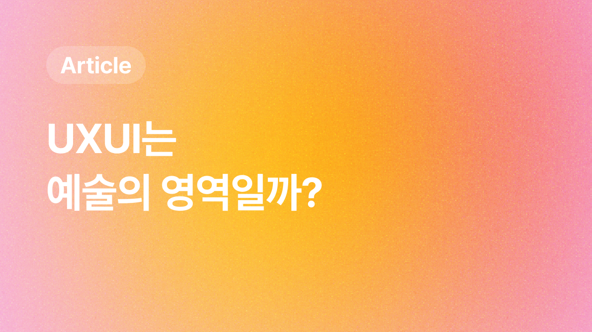

 

> UX/UI는 예술 영역인데, 왜 미대에 진학하거나 미술학원에 가지 않으셨어요?

한 번은 나름 인지도 있는 회사에서 실무 면접에서 받은 질문은 지금도 기억에 남는다. 
이 질문에 대한 내 생각을 블로그에 적어본다.

## 사용자 개념의 등장부터 UX라는 용어의 탄생까지 훑어보기

| 연대 | 설명                                                                                                                                                        |
| ---- | ----------------------------------------------------------------------------------------------------------------------------------------------------------- |
| 1950 | **헨리 드레이퍼스**가 **'사용자' 개념을 도입**해 인간공학을 연구하기 시작했다. 단순한 미적 표현이 아닌, 사용자의 **안전**과 **편의**를 고려했다.        |
| 1960 | **월트 디즈니**는 테마파크를 통해   **사용자의 즐거운 경험**을 설계해 현대 UX의 기초를 마련했다.                                                        |
| 1970 | **제록스 파크**에서 GUI(그래픽 사용자 인터페이스)와 마우스가 개발되며,  **컴퓨터와 사용자간 상호작용**이 변화했다.                                      |
| 1980 | **'사용성(Usability)'**과 **'HCI(Human-Computer Interaction)'** 개념이 등장하며 UX/UI가 체계화되었다.                                                       |
| 1990 | **도널드 노먼**이 1993년에 **'UX(User Experience)'**라는 용어를 도입해   디자인 분야에 **사용자 중심의 디자인 철학을 강조**한 새로운 패러다임이 생겼다. |

  

## UX/UI가 예술이 아닌 이유

UX/UI 디자인이 예술이 아닌 이유를 몇가지 생각해보았다.  

### 1. **UXUI는 측정이 가능하다**

---

UX/UI의 성공은 사용성, 효율성, 만족도와 같은 **구체적인 지표**로 평가가 가능하다. 요즘에는 GA는 물론이고 Mixpanel등 여러가지 툴을 사용해 사용자의 반응을 수집한다. 하지만, 예술은 주로 **주관적 평가**에 의존한다.  
우리는 미술관에 가서 미술 작품을 볼 떄, 이런말들을 하진 않는다. 

> "이 작품의 사용성이 좋네~" 
> "이 작품 인터페이스 끝내준다, 너무 편리해!"

 

### 2. UXUI는 체계적으로 접근한다.

---

수많은 기업들이 단순히 프로덕트를 세상에 내놓고 끝내지 않는다. 즉, 거듭된 개선으로 항상 사용자들에게 만족을 주기 위해 여러가지 사용자 연구, 테스트, 반복적 개선 등을 거친다, 즉 **체계적인 방법론**을 기반으로 제품을 점점 발전시킨다. 반면, 예술은 순간적인 **직관과 영감 그리고 창의성**에 더 의존한다. 우린 예술 작품이 User Testing으로 발전에 발전을 거듭하는 작품을 보지 못했다.

 

### 3. UXUI는 비즈니스 목표와도 닿아있다.

---

UX/UI 디자인은 사용자 경험을 개선하면서 동시에 **비즈니스 목표 달성**을 위한 전략을 포함하고 있다. 여러 분야의 직군 중, 특히 PMPO가 비즈니스에 더 큰 임팩트를 줄 수 있는 방향으로 청사진을 잡고 협업한다. 반면 예술은 상업적 고려사항에서 보다 자유롭다고 생각한다, 우리는 예술을 접하며 한번도 예술작품이 비즈니스에 더 큰 성과를 거두기 위한 전략을 잡는 것을 보지 못했다.

 

## 결론

도널드 노먼이 제시한 UX 개념 이후, UX/UI 디자인은 예술적 표현보다는 지속적으로 **사용자 중심의 문제 해결**과 **사용자의 경험 개선**에 초점을 맞춘 실용적이고 체계적인 분야로 발전해왔다. 이게 바로 UX/UI를 예술과 구별 짓는 핵심적인 이유라고 생각한다.

 

---

**👉 참고 자료 링크 모음**

- [예술과 디자인은 같은 걸까..? 다른걸까...? (ft. UI/UX디자이너)
  ](https://rosweet.tistory.com/267)
- [현대 전화기의 원형, 헨리 드레이퍼스](https://m.blog.naver.com/designpress2016/220937975490)
- [UX는 예술이 아니라 과학입니다](https://www.kimdirector.co.kr/987)
- [디자인은 예술이 아니며, UX는 디자인이 아닙니다.](https://brunch.co.kr/@c62b100079f3466/7)
- [UX 대 UI 디자인: 차이점 이해하기](https://pixcap.com/kr/blog/ux-vs-ui-design)

---
