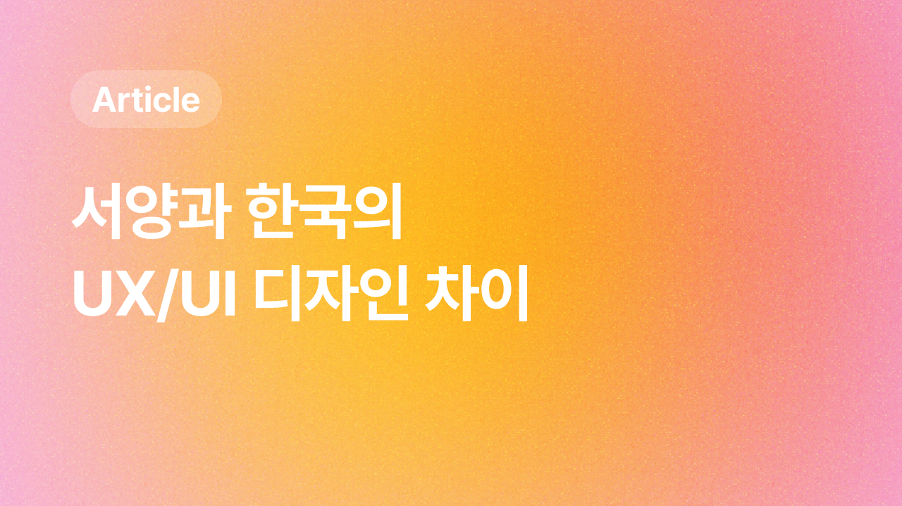

 

> 외국 연예인을 좋아하다보니 나는 평소에도 여러 외국 앱들을 자주 접한다. 
> 여러 외국 앱들을 접하며 느낀건 우리나라의 앱들의 디자인과 참 많이 다르다는 점이다. 
> 우리나라의 경우 좀 더 오밀조밀한 느낌인 반면, 외국앱은 심플하다고 느꼈다.  
> 오늘은 서양과 한국의 UXUI가 어떻게 다른지 살펴보려한다.

# 서양과 한국의 UX/UI 디자인 차이: 문화적 배경의 영향

UX/UI 디자인은 단순한 시각적 요소를 넘어 사용자의 경험과 제품의 가치를 전달하는 중요한 요소다. 
서양과 한국의 UX/UI 디자인에는 각 문화의 특성과 가치관에서 비롯된 뚜렷한 차이가 있다. 
이 글에서는 정보 밀도, 그래픽 스타일, 색상 사용의 세 가지 측면에서 이러한 차이를 살펴보려한다.
 

## 1. 정보 밀도: 문화적 요구와 사용자 경험

### 한국의 높은 정보 밀도 VS 서양의 여유로운 정보 배치

---

한국의 UX/UI 디자인은 일반적으로 한 화면에 많은 정보를 담는 경향이 있다.  
이는 사용자가 빠르게 정보를 소비하고자 하는 욕구를 반영한다. 
반면, 서양의 UX/UI 디자인은 상대적으로 여백을 많이 두고 정보를 분산시키는 경향이 있다.  
이는 사용자가 정보에 집중할 수 있도록 도와주며, 시각적으로도 편안함을 제공한다.

 

### 문화적 배경

---

| 국가     | 설명                                                                                              |
| -------- | ------------------------------------------------------------------------------------------------- |
| **한국** | 빠른 정보 소비와 다중 작업을 중시하는 문화. 한국어의 특성상 좁은 공간에 많은 정보를 담을 수 있다. |
| **서양** | 깊이 있는 경험과 집중을 중시하는 문화. 영어의 특성상 정보 표현에 더 많은 공간이 필요하다.         |

  

## 2. 그래픽 스타일: 감성적 요소와 기능성

### 한국의 귀여운 그래픽 VS 서양의 미니멀리즘

---

한국의 UX/UI 디자인에서는 귀여운 캐릭터와 아기자기한 아이콘은 사용자에게 친근감을 주고 감정적인 연결을 형성한다. 
서양에서는 미니멀리즘이 주를 이루며, 간결하고 직관적인 디자인을 선호한다. 불필요한 요소를 제거하고 핵심 기능에 집중해 사용자에게 명확한 메시지를 전달한다.

 

### 문화적 배경

---

| 국가     | 설명                                                          |
| -------- | ------------------------------------------------------------- |
| **한국** | 감정적 연결과 개성을 중시하는 문화. 집단주의적 성향이 강하다. |
| **서양** | 기능성과 효율성을 중시하는 문화. 개인주의적 성향이 강하다.    |

  

## 3. 색상 사용: 부드러움과 강렬함

### 한국의 파스텔 톤 VS 서양의 비비드한 색상

---

한국 디자인에서는 부드러운 파스텔 톤이 많이 사용한다. 이는 사용자에게 편안함과 친근함을 준다.
반면, 서양에서는 강렬하고 대조적인 색상이 자주 사용되어브랜드의 혁신성을 강조하는 데 효과적이다.

 

### 문화적 배경

---

| 국가     | 설명                                                                        |
| -------- | --------------------------------------------------------------------------- |
| **한국** | 부드럽고 따뜻한 이미지를 선호하는 문화. 감성적인 접근을 중시한다.           |
| **서양** | 강렬하고 눈에 띄는 이미지를 선호하는 문화. 이성적이고 쿨한 접근을 중시한다. |

  

## 결론

서양과 한국의 UX/UI 디자인은 각기 다른 문화적 배경에서 기인한 차이를 보여 사용자 경험에 큰 영향을 미친다. 
글로벌한 UX/UI 디자인을 위해서는 이런 문화 차이를 이해하고 반영하는 것이 필수적이라고 생각한다.

  

---

**👉 참고 자료 링크 모음**

- [해외 서비스 uxui는 왜 그래?](https://brunch.co.kr/@suyeonn/16)
- [왜 서양 앱들은 아시아권 보다 미니멀리즘이 강할까?](https://brunch.co.kr/@delight412/635)
- [문화 차이가 UX에 미치는 영향](https://blog.rightbrain.co.kr/?p=13518)

---
