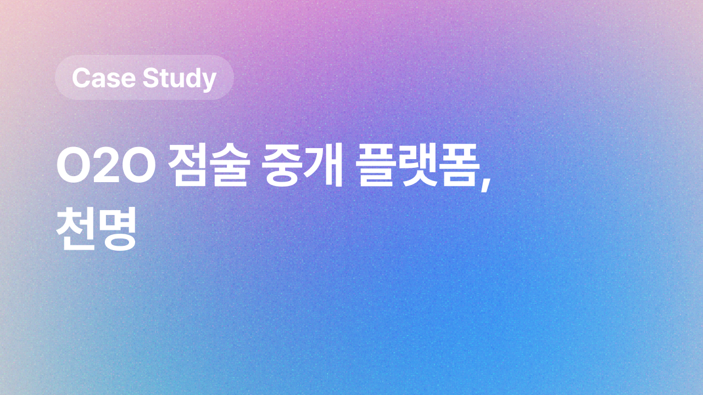
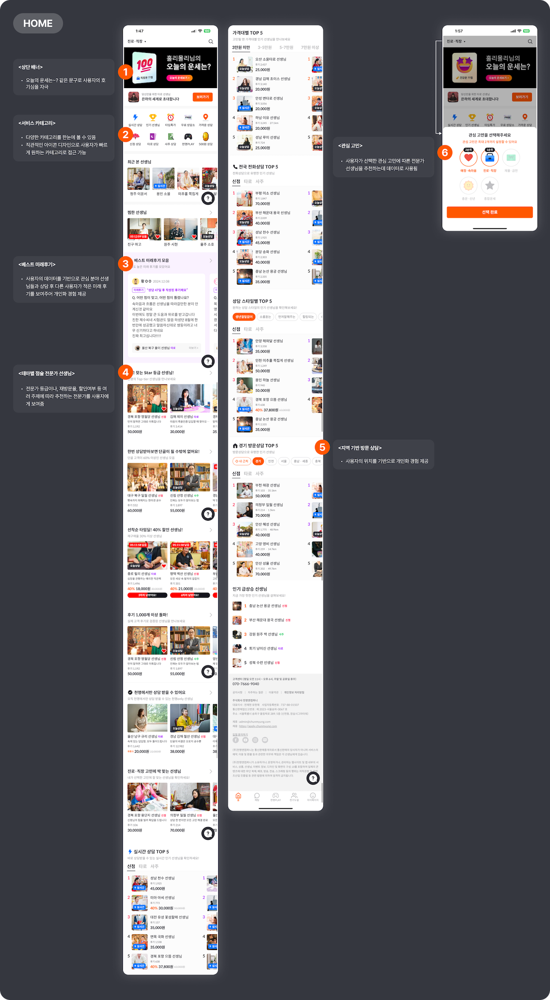
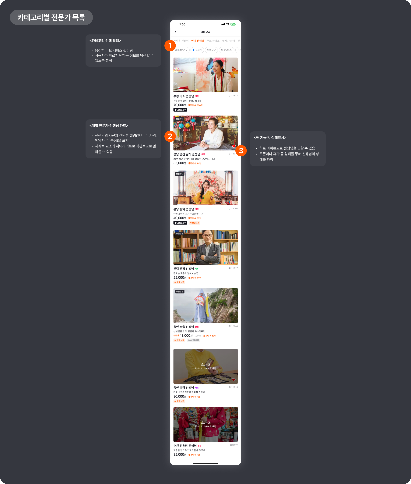
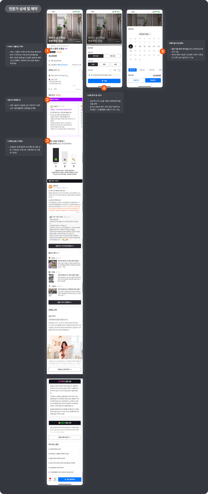
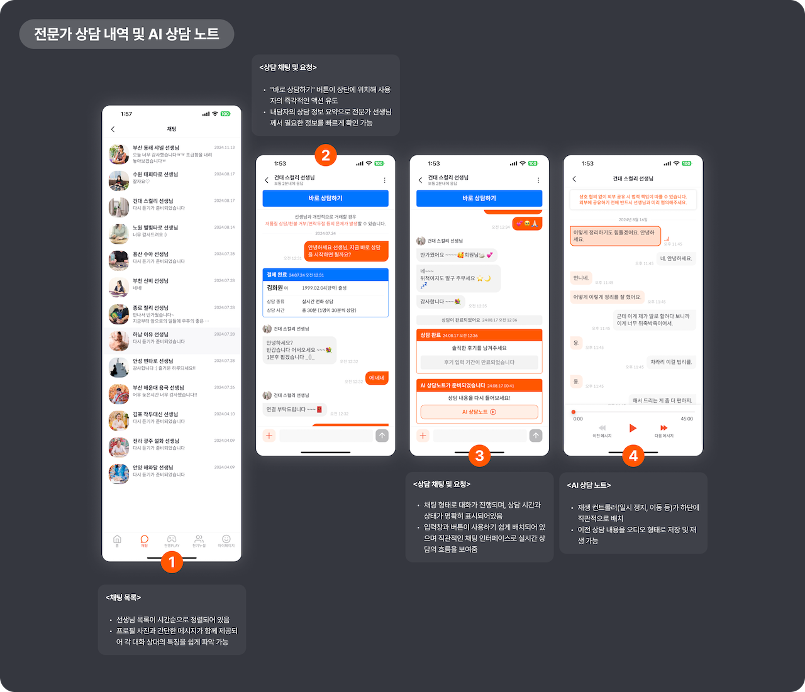
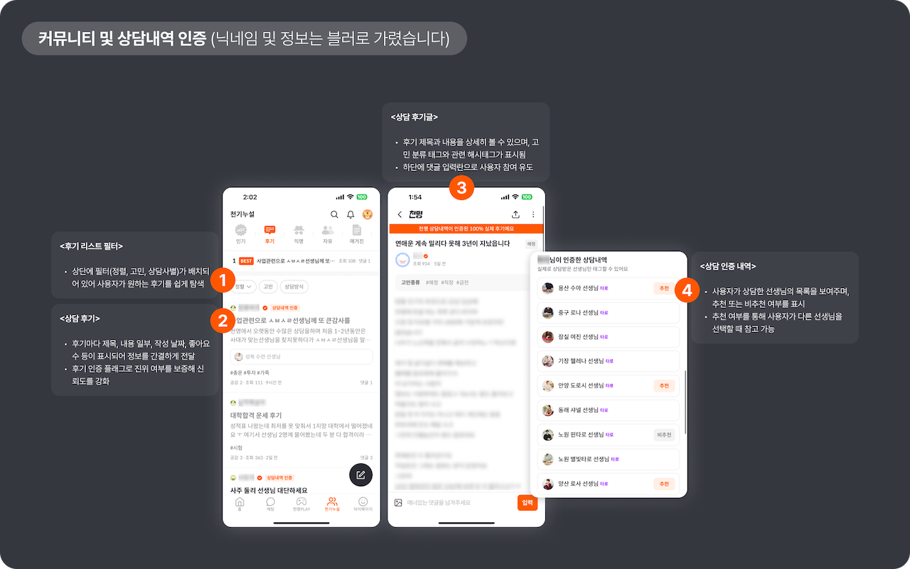
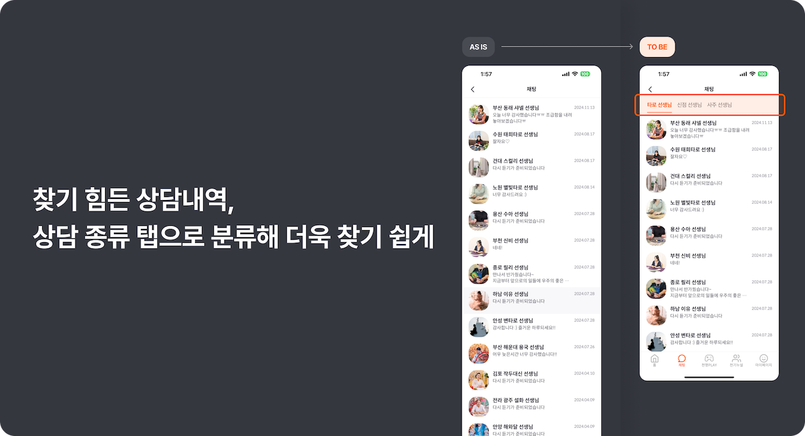
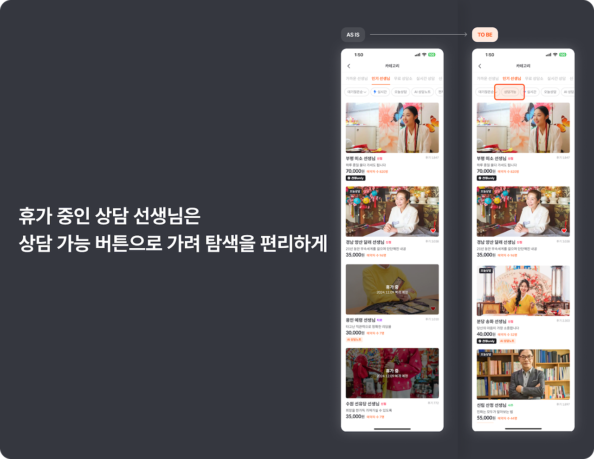
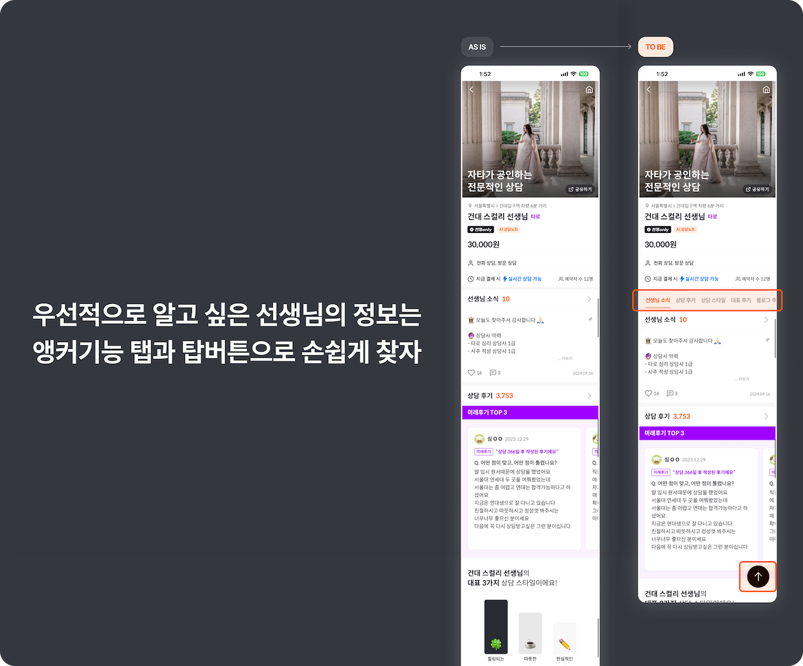
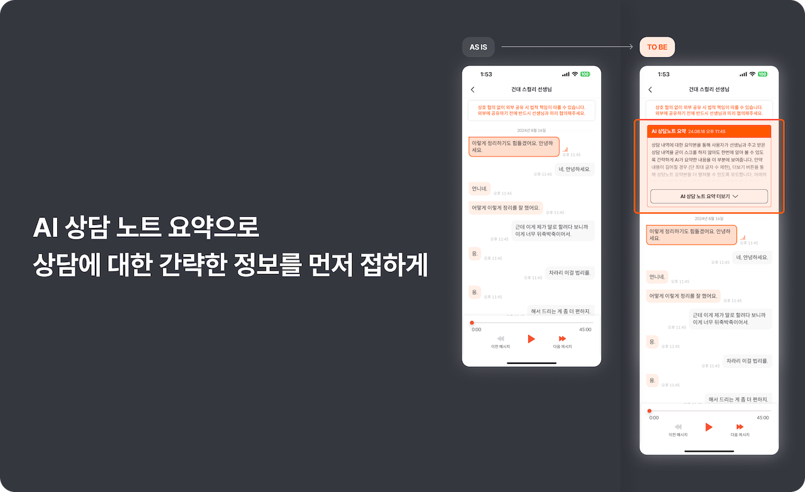

 

## 서비스 개요

| 제목          | 내용                                                                      |
| ------------- | ------------------------------------------------------------------------- |
| **서비스명**  | 천명                                                                      |
| **간단 소개** | 온·오프라인 연계(O2O) 점술 중개 플랫폼                                    |
| **주사용자**  | 온라인상으로(전화 또는 채팅) 검증된 전문가에게 점을 보고 싶은 2030 MZ세대 |

 

## 주요 화면 분석

### 홈화면

---

 

- **직관적인 서비스 카테고리 아이콘**으로 다양한 서비스 카테고리를 **사용자가 빠르게 원하는 카테고리로 접근** 가능하다.
- 미래 후기의 경우, **사용자의 데이터 기반**으로 내가 관심있어하는 고민에 관련된 점술 전문가 선생님의 상담 미래 후기를 보여주어 **개인화 경험**을 제공하고 있다.
- 할인 중인 전문가, 인기 전문가 등 콘텐츠별로 **사용자의 관심을 끌만한 주제**로 묶었다. 그 중에서도 할인중인 전문가는 **할인율 표시와 더불어 잔여 자릿수도** 보여주어 더욱 사용자의 **구매 의욕을 자극**한다.

  

### 전문가 목록

---

 

- 상단 메뉴 카테고리 선택 및 필터를 통해 **주요 서비스 필터링이 용이**하며, 사용자가 **빠르게 원하는 정보를 탐색**할 수 있도록 설계되었다.
- 개별 선생님 카드 디자인에서 선생님의 사진을 볼 수 있는데, 사진을 크게 배치해 신뢰감을 주며, **후기와 예약자 수 등으로 사회적 증거(Social Proof)를 제공**한다.
- **가격과 특징(예: "AI 상담노트", "오늘 상담 가능")을 강조**해 사용자가 선택을 쉽게 할 수 있도록 유도한다.
- **"휴가 중"** 상태 표시로 사용자가 **비활성화된 서비스를 인지**할 수 있다.

  

### 전문가 상세 화면 및 상담 예약

---

 

- **서비스 이름과 가격이 큰 텍스트로 배치**되어 있어 시각적으로 **가장 먼저 눈에 들어오며** 예약 가능한 상태(실시간/방문 상담)와 예약 시간이 명확히 구분되어 있어 정보 제공이 직관적이다. 게다가 서비스 이미지가 화면 상단에 화질도 좋은 이미지로 더욱 신뢰성이 돋보인다.
- 선생님의 상세 정보와 주요 특징(후기, 대표 상담 스타일 등)이 간결히 요약되어있고 "대표 상담 스타일"을 그래프와 아이콘, 해시태그와 함께 제공하여 한눈에 이해할 수 있다.
- "상담 사례"라는 구체적인 사례를 통해 사용자가 자신의 상황과 관련성을 쉽게 느낄 수 있도록 설계된 것 같다.
- **CTA "상담 문의하기" 버튼이 화면 하단 중앙에 고정**되어 있어 사용자가 쉽게 액션을 취할 수 있다.

  

### 채팅 상담 내역 및 AI 상담노트

---

 

- 채팅 리스트 화면의 경우 선생님 목록이 시간순으로 정렬되어 있고 프로필 사진과 간단한 메시지가 함께 제공되어 각 대화 상대의 특징을 쉽게 파악 할 수 있다.
- 상담 채팅의 경우, 상담 내용 요약(예약 시간, 상담 유형 등)이 명확히 정리되어 있어서 상담 선생님과 사용자 모두 직관적으로 인지가 가능하다.
- 상담 채팅 내역에서 **"바로 상담하기" 버튼이 상단에 위치**해 사용자의 **즉각적인 액션 유도**로 추후 재상담으로도 이어질 수 있다.
- AI 상담노트의 경우 **재생 컨트롤러(일시 정지, 이동 등)가 하단에 직관적으로 배치**되어있어 쉽게 사용할 수 있다.

  

### 사용자 커뮤니티 및 상담 후기

---

 

> 사용자의 닉네임이나 후기 정보는 블러로 가렸다. 아무래도 개인 사생활 정보이다보니..

- 상단에 **필터(정렬, 고민, 상담사별)**가 배치되어 있어 사용자가 원하는 후기를 쉽게 탐색할 수 있다.
- 후기마다 제목, 내용 일부, 작성 날짜, 좋아요 수 등이 표시되어 정보를 간결하게 전달하며 **"상담내역 인증" 플래그로 추가되어 신뢰도**를 높였다.
- 후기 제목과 내용을 상세히 볼 수 있으며, 고민 분류 태그와 관련 해시태그가 표시되었고 하단에 댓글 입력란이 있어 사용자 참여를 유도한다.
- **실제 사용자가 사용자가 상담**한 선생님의 목록을 보여주어 **신뢰도를 높이고** 또한 **추천 또는 비추천 여부**를 표시하는데 추천 여부를 통해 사용자가 **다른 선생님을 선택할 때 참고** 할 수 있어 **계속적으로 서비스를 사용**하게 만드는 요인으로 작용한다.

   

## 아쉬운 부분과 개선안

### 찾기 힘든 상담내역, 상담 종류 탭으로 분류해 더욱 찾기 쉽게

---

 

| 제목      | 내용                                                                                                                                                                                      |
| --------- | ----------------------------------------------------------------------------------------------------------------------------------------------------------------------------------------- |
| **AS IS** | **모든 선생님이 동일 화면에** 표시되어 상담이 많아질수록 사용자는 찾기 힘든 상황이 생길 수 있다.                                                                                          |
| **TO BE** | 선생님을 **상담 유형별로 분류**하여, 사용자의 탐색을 개선한다.   추후 서비스 고도화로 사용자가 상담한 일자, 선생님 성함 등으로 추가 필터링을 거치는 것 역시 고려해볼 수 있을 것 같다. |

  

### 휴가 중인 상담 선생님은 상담 가능 버튼으로 가려 탐색을 편리하게

---

 

| 제목      | 내용                                                                                                                                                                                                       |
| --------- | ---------------------------------------------------------------------------------------------------------------------------------------------------------------------------------------------------------- |
| **AS IS** | 휴가중인 전문가 선생님까지 모두 한 화면에 나오다 보니, **스크롤**도 길어질 뿐더러 사용자는 **불필요한 정보를 추가적으로 접하는 상황**이 발생한다. (사용자는 지금 상담이 불가능한 선생님을 알 필요가 없다.) |
| **TO BE** | 휴가중인 선생님을 **상담 가능 버튼을 상단 필터에 추가**해 사용자가 불필요한 정보를 얻는 상황을 방지한다.                                                                                                   |

  

### 우선적으로 알고 싶은 선생님의 정보는 앵커기능 탭과 탑버튼으로 손쉽게 찾자

---

 

| 제목      | 내용                                                                                                                                                                                                   |
| --------- | ------------------------------------------------------------------------------------------------------------------------------------------------------------------------------------------------------ |
| **AS IS** | 선생님의 **상세 내역에는 각종 정보가 집약**되어있는만큼 사용자는 한번에 여러 정보를 접해 좋지만, 여러 정보가 **오히려 사용자가 원하는 정보를 빠르게 찾는데 힘든 요인**이 될 수 있다.                   |
| **TO BE** | 먼저 **앵커 기능 탭**을 통해서 사용자는 **원하는 정보로 빠르게 이동**할 수 있도록 유도한다, 동시에 사용자가 **다시 원하는 정보를 탐색하는 탭으로 이동**할 수 있게 하단에 **플로팅 탑버튼**을 추가했다. |

  

### AI 상담 노트 요약으로 상담에 대한 간략한 정보를 먼저 접하게

---

 

| 제목      | 내용                                                                                                                                                                                                                                                       |
| --------- | ---------------------------------------------------------------------------------------------------------------------------------------------------------------------------------------------------------------------------------------------------------- |
| **AS IS** | AI 상담노트에서 사용자는 상담 내역을 보다 상세하게 볼 수있지만, 시간이 오래 흐른 상담이거나 상담 내용이 너무 긴 경우 사용자는 **어떤 상담을 진행했는지 인지하기 힘든 경우**가 발생한다.                                                                    |
| **TO BE** | 상담 노트 최상단에 미리 **상담의 간략한 내용을 인지**하도록 **AI 상담 노트 요약본**을 제공해 사용자의 상담 내용 복기를 돕는다. 더불어 긴 상담 내용 요약의 경우, 더보기 버튼으로 펼쳐볼 수 있도록 유도한다.(단, 정책상 요약의 최대 글자수 제한은 필요하다.) |

  
